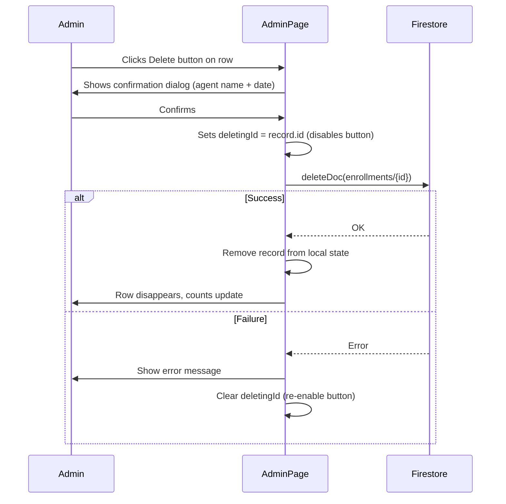

# Design Document: Admin Delete Enrollment Record

## Overview

This feature adds per-row deletion of enrollment records in the Admin page's "Enrollment Records" tab. Admins can click a Delete button on any row, confirm via a dialog, and have the record permanently removed from Firestore and the local UI state — with appropriate loading feedback and error handling.

The implementation is entirely frontend-only. No backend changes are required. The Firestore `deleteDoc` SDK call is already imported in `AdminPage.tsx` (used for agent deletion), so the pattern is already established.

## Architecture

The feature lives entirely within `frontend/src/pages/AdminPage.tsx` and `frontend/firestore.rules`.



## Components and Interfaces

### State additions to `AdminPage`

```typescript
const [deletingId, setDeletingId] = useState<string | null>(null);
```

`deletingId` holds the document ID of the record currently being deleted. While set, the corresponding row's Delete button is disabled and shows a spinner. It is cleared on both success and failure.

### `handleDeleteEnrollment` function

```typescript
async function handleDeleteEnrollment(record: Enrollment): Promise<void>
```

- Shows `window.confirm` with the record's agent name and date.
- On cancel: returns immediately, no state change.
- On confirm: sets `deletingId`, calls `deleteDoc`, then either removes the record from `enrollments` state or shows an error alert, then clears `deletingId`.

### Delete button in the enrollment table row

Added as a new column ("Actions") in the enrollment table. Rendered per row:

```tsx
<button
  onClick={() => handleDeleteEnrollment(r)}
  disabled={deletingId === r.id}
  className="... red styling ..."
>
  {deletingId === r.id ? <spinner /> : 'Delete'}
</button>
```

### Firestore security rule change

The `enrollments` match block gains an explicit `delete` rule:

```
allow delete: if isAdmin();
```

The existing `isAdmin()` helper already checks `request.auth != null` and that the user's Firestore document has `role == 'ADMIN'`, so no new helper is needed.

## Data Models

No schema changes. The existing `Enrollment` interface and Firestore `enrollments` collection are unchanged. The delete operation uses the document's `id` field (already present on every `Enrollment` object as populated from `d.id` in the `getDocs` snapshot mapping).

```typescript
interface Enrollment {
  id: string;           // Firestore document ID — used as the delete target
  date: string;
  agentName: string;
  agentEmail: string;
  stateName: string;
  lgaName: string;
  wardName: string;
  deviceId: string;
  dailyFigures: number;
  issuesComplaints: string;
  submittedAt: string;
}
```

The `filtered` array is derived from `enrollments` state, so removing a record from `enrollments` automatically updates `filtered`, the displayed count, and the `totalFigures` sum — no extra logic needed.


## Correctness Properties

*A property is a characteristic or behavior that should hold true across all valid executions of a system — essentially, a formal statement about what the system should do. Properties serve as the bridge between human-readable specifications and machine-verifiable correctness guarantees.*

### Property 1: Every non-empty enrollment row has a Delete button

*For any* non-empty list of enrollment records rendered in the table, every row must contain exactly one Delete button element.

**Validates: Requirements 1.1**

---

### Property 2: Confirmation dialog identifies the record

*For any* enrollment record, when the Delete button for that record is clicked, the confirmation dialog text must contain both the record's agent name and its date.

**Validates: Requirements 2.1**

---

### Property 3: Cancel leaves the list unchanged

*For any* enrollment list, if the admin clicks Delete on a record and then cancels the confirmation dialog, the enrollment list must be identical to its state before the click (same length, same records).

**Validates: Requirements 2.2**

---

### Property 4: Confirmed deletion calls deleteDoc with the correct ID

*For any* enrollment record, when the admin confirms deletion, `deleteDoc` must be called exactly once with a document reference whose path ends in the record's document ID.

**Validates: Requirements 3.1**

---

### Property 5: Successful deletion removes the record from local state

*For any* enrollment list and any record in that list, after a successful `deleteDoc` call the record must no longer appear in the displayed list, and the record count and total enrollees figure must reflect the removal.

**Validates: Requirements 3.2, 3.3**

---

### Property 6: Failed deletion retains the record and shows an error

*For any* enrollment record, when `deleteDoc` rejects with an error, the record must remain in the displayed list and an error message must be visible to the admin.

**Validates: Requirements 3.4, 4.3, 5.3**

---

### Property 7: Firestore delete is restricted to ADMIN role

*For any* authenticated user, a `delete` operation on a document in the `enrollments` collection must be permitted if and only if that user's Firestore `users/{uid}` document has `role == "ADMIN"`.

**Validates: Requirements 4.1, 4.2**

---

### Property 8: Delete button is disabled while deletion is in progress

*For any* enrollment record, while its `deleteDoc` call is pending (not yet resolved or rejected), the Delete button for that record must be in a disabled state and must display a loading indicator.

**Validates: Requirements 5.1, 5.2**

---

## Error Handling

| Scenario | Handling |
|---|---|
| `deleteDoc` rejects (network error, Firestore unavailable) | Show `alert` with `err.message`; retain record in state; clear `deletingId` |
| `deleteDoc` rejects with `permission-denied` | Same alert path — message will include "permission-denied"; record retained |
| Admin cancels confirmation dialog | `window.confirm` returns `false`; function returns early; no state change |
| Delete clicked while another deletion is in progress on the same row | Button is `disabled`; click event is suppressed by the browser |

All error paths clear `deletingId` in a `finally` block so the button never stays permanently disabled.

## Testing Strategy

### Unit / Component Tests (Vitest + React Testing Library)

Focus on specific examples, edge cases, and integration between the handler and the UI:

- **Example**: Empty enrollment list renders no Delete buttons (Requirement 1.2).
- **Example**: Cancelling the dialog leaves `enrollments` state unchanged (Property 3).
- **Example**: Confirming calls `deleteDoc` with the right doc ref (Property 4).
- **Example**: Successful delete removes the row and updates the count (Property 5).
- **Example**: Failed delete shows an error and keeps the row (Property 6).
- **Example**: Button is disabled and shows spinner while deletion is pending (Property 8).

### Property-Based Tests (fast-check)

Use [fast-check](https://github.com/dubzzz/fast-check) for the React component properties and the [Firebase Rules Unit Testing](https://firebase.google.com/docs/rules/unit-tests) library for Firestore rule properties.

Each property test must run a minimum of **100 iterations**.

Tag format for each test: `Feature: admin-delete-record, Property {N}: {property_text}`

| Property | Test approach |
|---|---|
| Property 1 | Generate arbitrary arrays of `Enrollment` objects (length ≥ 1); render table; assert every row has a delete button |
| Property 2 | Generate arbitrary `Enrollment`; mock `window.confirm` to capture the message; assert it contains `agentName` and `date` |
| Property 3 | Generate arbitrary enrollment list; mock `window.confirm` → `false`; assert state is unchanged |
| Property 4 | Generate arbitrary `Enrollment`; mock `window.confirm` → `true` and `deleteDoc` → resolves; assert `deleteDoc` called with correct path |
| Property 5 | Generate arbitrary list + pick a random record; mock success; assert record absent and counts correct |
| Property 6 | Generate arbitrary `Enrollment`; mock `deleteDoc` → rejects; assert record still in list and error shown |
| Property 7 | Use Firebase Rules Unit Testing; generate arbitrary `role` strings; assert delete allowed iff `role === "ADMIN"` |
| Property 8 | Generate arbitrary `Enrollment`; mock `deleteDoc` with a never-resolving promise; assert button `disabled` and spinner present |
