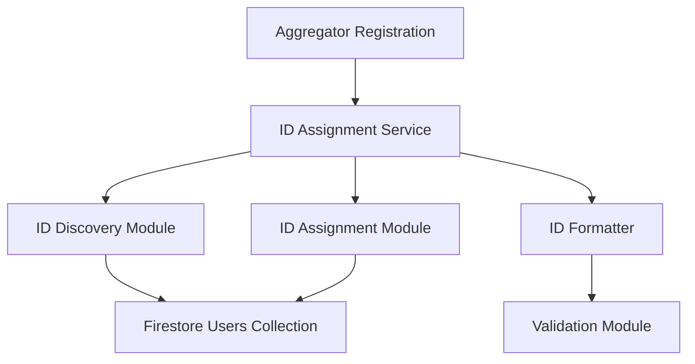

# Design Document: Aggregator ID Gap-Filling System

## Overview

This design specifies an intelligent aggregator ID assignment system that automatically assigns the lowest available ID number to new aggregators. The system fills gaps in the ID sequence before incrementing to higher numbers, ensuring efficient use of the ID space and maintaining a compact, sequential numbering system.

### Key Design Goals

1. **Gap-First Assignment**: Prioritize filling gaps in the ID sequence before assigning higher numbers
2. **Concurrency Safety**: Prevent duplicate ID assignments when multiple aggregators register simultaneously
3. **Format Consistency**: Maintain three-digit zero-padded format (001, 042, 256)
4. **Backward Compatibility**: Preserve existing aggregator IDs without modification
5. **Performance**: Complete ID assignment within 5 seconds under normal load

### Technology Stack

- **Database**: Firestore (existing)
- **Backend**: Node.js/Express with TypeScript
- **Frontend**: React with TypeScript
- **Testing**: Vitest for unit tests, fast-check for property-based tests

## Architecture

### System Components



### Component Responsibilities

1. **ID Assignment Service**: Orchestrates the ID assignment workflow
2. **ID Discovery Module**: Queries Firestore and identifies available IDs
3. **ID Assignment Module**: Assigns IDs with concurrency control
4. **ID Formatter**: Formats numeric IDs as zero-padded strings
5. **Validation Module**: Validates ID format and constraints

### Data Flow

1. New aggregator initiates registration
2. ID Assignment Service requests available IDs from ID Discovery Module
3. ID Discovery Module queries Firestore for existing aggregator IDs
4. ID Discovery Module parses IDs and identifies gaps
5. ID Assignment Service selects lowest available ID (gap or next sequential)
6. ID Formatter converts numeric ID to zero-padded string
7. ID Assignment Module writes to Firestore with transaction/retry logic
8. Assigned ID is returned to the registration flow

## Components and Interfaces

### ID Assignment Service

**Location**: `backend/src/services/aggregatorIdService.ts`

**Primary Function**: `assignAggregatorId(userId: string): Promise<string>`

**Responsibilities**:
- Orchestrate the ID assignment workflow
- Handle errors and retries
- Log assignment operations
- Return assigned ID or throw descriptive error

**Interface**:
```typescript
interface AggregatorIdService {
  assignAggregatorId(userId: string): Promise<string>;
}
```

### ID Discovery Module

**Location**: `backend/src/services/aggregatorIdService.ts` (internal functions)

**Primary Function**: `findAvailableIds(): Promise<{ gaps: number[], nextSequential: number }>`

**Responsibilities**:
- Query Firestore users collection for all aggregator IDs
- Parse aggregator IDs into numeric values
- Identify gaps in the sequence (missing numbers between 1 and max)
- Calculate next sequential ID (max + 1)
- Handle edge cases (empty collection, invalid IDs)

**Interface**:
```typescript
interface IdDiscoveryResult {
  gaps: number[];           // Sorted array of gap IDs [3, 7, 12]
  nextSequential: number;   // Next ID after highest assigned
}

function findAvailableIds(): Promise<IdDiscoveryResult>;
```

**Algorithm**:
1. Query all users with role='AGGREGATOR' from Firestore
2. Extract aggregatorId field from each document
3. Filter out null/empty/invalid IDs
4. Parse each ID to numeric value (strip leading zeros)
5. Find max ID in the set
6. Generate set of all numbers from 1 to max
7. Compute gaps = (1..max) - (assigned IDs)
8. Sort gaps ascending
9. Return { gaps, nextSequential: max + 1 }

### ID Assignment Module

**Location**: `backend/src/services/aggregatorIdService.ts` (internal functions)

**Primary Function**: `assignIdToUser(userId: string, aggregatorId: string): Promise<void>`

**Responsibilities**:
- Write aggregator ID to Firestore user document
- Handle concurrency conflicts with retry logic
- Ensure atomic assignment (transaction or conditional write)

**Concurrency Strategy**:

Firestore doesn't support traditional transactions for conditional field updates across queries. We'll use an **optimistic locking pattern with retry**:

1. Read current user document
2. Verify aggregatorId field is null/empty (not already assigned)
3. Attempt to write aggregatorId using Firestore update with precondition
4. If write fails due to conflict, retry with next available ID
5. Maximum 3 retry attempts before failing

**Interface**:
```typescript
async function assignIdToUser(
  userId: string, 
  aggregatorId: string, 
  maxRetries: number = 3
): Promise<void>;
```

### ID Formatter

**Location**: `backend/src/services/aggregatorIdService.ts` (utility function)

**Primary Function**: `formatAggregatorId(numericId: number): string`

**Responsibilities**:
- Convert numeric ID to zero-padded string
- Apply formatting rules (001, 042, 256)

**Interface**:
```typescript
function formatAggregatorId(numericId: number): string;
```

**Implementation**:
```typescript
function formatAggregatorId(numericId: number): string {
  return numericId.toString().padStart(3, '0');
}
```

### Validation Module

**Location**: `backend/src/services/aggregatorIdService.ts` (utility functions)

**Primary Function**: `parseAggregatorId(id: string): number | null`

**Responsibilities**:
- Parse aggregator ID strings to numeric values
- Validate ID format
- Handle both zero-padded and non-zero-padded strings

**Interface**:
```typescript
function parseAggregatorId(id: string): number | null;
function isValidAggregatorId(id: string): boolean;
```

## Data Models

### Firestore User Document

**Collection**: `users`

**Relevant Fields**:
```typescript
interface UserDocument {
  id: string;                    // Firestore document ID (Firebase Auth UID)
  email: string;
  name: string;
  role: 'AGENT' | 'AGGREGATOR' | 'ADMIN';
  aggregatorId?: string;         // Three-digit zero-padded ID (e.g., "001", "042")
  // ... other fields
}
```

**Constraints**:
- `aggregatorId` is optional (only present for aggregators)
- `aggregatorId` must be unique across all users
- `aggregatorId` format: /^\d{3,}$/ (three or more digits, zero-padded)

### ID Assignment State

**Transient Data Structure** (not persisted):

```typescript
interface IdAssignmentState {
  assignedIds: Set<number>;      // All currently assigned numeric IDs
  gaps: number[];                // Available gap IDs (sorted ascending)
  nextSequential: number;        // Next ID after highest assigned
}
```

## Error Handling

### Error Types

1. **ConcurrencyError**: Multiple aggregators assigned same ID
   - **Cause**: Race condition during concurrent registrations
   - **Handling**: Retry with next available ID (up to 3 attempts)
   - **User Impact**: Transparent retry, no user action needed

2. **FirestoreError**: Database query or write failure
   - **Cause**: Network issues, permission errors, Firestore downtime
   - **Handling**: Log error, return descriptive message to caller
   - **User Impact**: Registration fails, user sees error message

3. **ValidationError**: Invalid user ID or aggregator ID format
   - **Cause**: Programming error or data corruption
   - **Handling**: Log error, throw exception
   - **User Impact**: Registration fails, admin notification

4. **TimeoutError**: ID assignment exceeds 5-second limit
   - **Cause**: High load, slow Firestore queries, excessive retries
   - **Handling**: Log error, abort operation
   - **User Impact**: Registration fails, user can retry

### Error Recovery

**Retry Logic**:
```typescript
async function assignAggregatorIdWithRetry(userId: string): Promise<string> {
  const maxAttempts = 3;
  let attempt = 0;
  
  while (attempt < maxAttempts) {
    try {
      const { gaps, nextSequential } = await findAvailableIds();
      const numericId = gaps.length > 0 ? gaps[0] : nextSequential;
      const aggregatorId = formatAggregatorId(numericId);
      
      await assignIdToUser(userId, aggregatorId);
      
      // Log successful assignment
      console.log(`Assigned aggregator ID ${aggregatorId} to user ${userId}`);
      
      return aggregatorId;
    } catch (error) {
      attempt++;
      
      if (error.code === 'CONFLICT' && attempt < maxAttempts) {
        // Retry on concurrency conflict
        console.warn(`ID assignment conflict, retrying (attempt ${attempt}/${maxAttempts})`);
        continue;
      }
      
      // Non-retryable error or max attempts reached
      console.error(`Failed to assign aggregator ID: ${error.message}`);
      throw error;
    }
  }
  
  throw new Error('Failed to assign aggregator ID after maximum retry attempts');
}
```

### Logging

All ID assignment operations will be logged with:
- Timestamp
- User ID
- Assigned aggregator ID
- Operation status (success/failure)
- Error details (if applicable)

**Log Format**:
```
[2025-01-15T10:30:45.123Z] AggregatorID: Assigned ID "007" to user "abc123xyz" (success)
[2025-01-15T10:30:47.456Z] AggregatorID: Failed to assign ID to user "def456uvw" (error: Firestore timeout)
```


## Correctness Properties

*A property is a characteristic or behavior that should hold true across all valid executions of a system—essentially, a formal statement about what the system should do. Properties serve as the bridge between human-readable specifications and machine-verifiable correctness guarantees.*

### Property 1: ID Parsing Correctness

*For any* valid aggregator ID string (zero-padded or non-zero-padded numeric string), parsing the ID should produce the correct numeric value, and parsing should handle both formats consistently.

**Validates: Requirements 1.2, 5.3, 6.4**

**Test Strategy**: Generate random numeric IDs, format them with various padding (001, 01, 1), parse them back, and verify the numeric value is correct.

### Property 2: ID Formatting Correctness

*For any* numeric ID value, formatting the ID should produce a zero-padded string following these rules:
- Numbers < 10: two leading zeros (001, 007)
- Numbers 10-99: one leading zero (042, 099)
- Numbers ≥ 100: no leading zeros (100, 256)

**Validates: Requirements 2.3, 4.1, 4.2, 4.3, 4.4**

**Test Strategy**: Generate random numeric IDs across all ranges (1-9, 10-99, 100-999), format them, and verify the output matches the expected zero-padded format.

### Property 3: Formatting Round-Trip Preserves Value

*For any* numeric ID value, formatting then parsing should return the original numeric value (round-trip property).

**Validates: Requirements 1.2, 2.3**

**Test Strategy**: Generate random numeric IDs, format them to strings, parse them back to numbers, and verify the result equals the original value.

### Property 4: Gap Detection Correctness

*For any* set of assigned numeric IDs, the gap detection algorithm should:
1. Identify all missing numbers in the range [1, max(assignedIds)]
2. Return gaps in ascending order
3. Ensure no gap overlaps with assigned IDs
4. Calculate nextSequential as max(assignedIds) + 1

**Validates: Requirements 1.3, 1.4, 5.2**

**Test Strategy**: Generate random sets of assigned IDs, run gap detection, and verify:
- All numbers in [1, max] that are not in assignedIds appear in gaps
- All gaps are sorted ascending
- No gap exists in assignedIds
- nextSequential = max(assignedIds) + 1

### Property 5: ID Selection Correctness (Gap Priority)

*For any* set of assigned IDs where gaps exist, the ID selection algorithm should return the lowest gap number (minimum value in the gaps array).

**Validates: Requirements 2.1**

**Test Strategy**: Generate random sets of assigned IDs with guaranteed gaps, run ID selection, and verify the selected ID equals the minimum gap.

### Property 6: ID Selection Correctness (Sequential Fallback)

*For any* contiguous set of assigned IDs [1, 2, 3, ..., n] with no gaps, the ID selection algorithm should return n + 1 (the next sequential number).

**Validates: Requirements 2.2**

**Test Strategy**: Generate random contiguous sequences [1..n], run ID selection, and verify the selected ID equals n + 1.

### Property 7: ID Selection Always Returns Minimum Available

*For any* set of assigned IDs, the ID selection algorithm should return the minimum value from the set (gaps ∪ {nextSequential}).

**Validates: Requirements 2.1, 2.2**

**Test Strategy**: Generate random sets of assigned IDs (with and without gaps), run ID selection, and verify the selected ID equals min(gaps ∪ {nextSequential}).

### Property 8: Empty System Assigns First ID

*For any* empty set of assigned IDs, the ID selection algorithm should return 1 (which formats to "001").

**Validates: Requirements 6.1, 6.2**

**Test Strategy**: Run ID selection with empty assigned IDs set, verify selected ID is 1.

**Note**: This is technically an example test (specific case), but it's included here as a degenerate case of the gap detection property.


## Testing Strategy

### Overview

This feature will use a **dual testing approach** combining property-based tests for core logic and example-based tests for integration concerns:

1. **Property-Based Tests**: Verify universal properties of the ID assignment algorithm (parsing, formatting, gap detection, ID selection)
2. **Unit Tests**: Verify specific examples, edge cases, and error handling
3. **Integration Tests**: Verify Firestore interactions and concurrency behavior

### Property-Based Testing

**Library**: [fast-check](https://github.com/dubzzz/fast-check) (JavaScript/TypeScript property-based testing library)

**Configuration**:
- Minimum 100 iterations per property test
- Each test tagged with: `Feature: aggregator-id-gap-filling, Property {number}: {property_text}`

**Property Tests to Implement**:

1. **Property 1: ID Parsing Correctness**
   - Generator: Random numeric IDs (1-999), formatted with various padding
   - Assertion: `parseAggregatorId(formattedId) === numericId`
   - Tag: `Feature: aggregator-id-gap-filling, Property 1: ID Parsing Correctness`

2. **Property 2: ID Formatting Correctness**
   - Generator: Random numeric IDs (1-999)
   - Assertion: Verify zero-padding rules based on ID range
   - Tag: `Feature: aggregator-id-gap-filling, Property 2: ID Formatting Correctness`

3. **Property 3: Formatting Round-Trip Preserves Value**
   - Generator: Random numeric IDs (1-999)
   - Assertion: `parseAggregatorId(formatAggregatorId(id)) === id`
   - Tag: `Feature: aggregator-id-gap-filling, Property 3: Formatting Round-Trip Preserves Value`

4. **Property 4: Gap Detection Correctness**
   - Generator: Random sets of assigned IDs (size 0-50, values 1-100)
   - Assertion: Verify gaps are exactly missing numbers in [1, max], sorted, non-overlapping
   - Tag: `Feature: aggregator-id-gap-filling, Property 4: Gap Detection Correctness`

5. **Property 5: ID Selection Correctness (Gap Priority)**
   - Generator: Random sets of assigned IDs with guaranteed gaps
   - Assertion: `selectedId === Math.min(...gaps)`
   - Tag: `Feature: aggregator-id-gap-filling, Property 5: ID Selection Correctness (Gap Priority)`

6. **Property 6: ID Selection Correctness (Sequential Fallback)**
   - Generator: Random contiguous sequences [1..n]
   - Assertion: `selectedId === n + 1`
   - Tag: `Feature: aggregator-id-gap-filling, Property 6: ID Selection Correctness (Sequential Fallback)`

7. **Property 7: ID Selection Always Returns Minimum Available**
   - Generator: Random sets of assigned IDs (with and without gaps)
   - Assertion: `selectedId === Math.min(...gaps, nextSequential)`
   - Tag: `Feature: aggregator-id-gap-filling, Property 7: ID Selection Always Returns Minimum Available`

8. **Property 8: Empty System Assigns First ID**
   - Generator: Empty set of assigned IDs
   - Assertion: `selectedId === 1`
   - Tag: `Feature: aggregator-id-gap-filling, Property 8: Empty System Assigns First ID`

### Unit Tests (Example-Based)

**Test Cases**:

1. **Empty System Behavior** (Requirement 6.1, 6.2)
   - Input: Empty assigned IDs
   - Expected: Assign "001"

2. **Null/Empty ID Filtering** (Requirement 6.3)
   - Input: User documents with null/empty aggregatorId fields
   - Expected: Exclude from assigned IDs set

3. **Existing ID Preservation** (Requirement 5.1)
   - Input: User with existing aggregatorId
   - Expected: Service skips user, doesn't overwrite

4. **Retry Logic on Conflict** (Requirement 3.2)
   - Input: Simulated Firestore conflict error
   - Expected: Service retries with next available ID

5. **Error Handling** (Requirement 7.2)
   - Input: Various error scenarios (Firestore error, timeout, validation error)
   - Expected: Descriptive error messages returned

6. **Logging Verification** (Requirement 7.3)
   - Input: Successful and failed ID assignments
   - Expected: Log entries with timestamp, user ID, assigned ID, status

### Integration Tests

**Test Cases**:

1. **Firestore Query Integration** (Requirement 1.1)
   - Verify service correctly queries Firestore users collection
   - Verify query filters by role='AGGREGATOR'

2. **Firestore Write Integration** (Requirement 2.4)
   - Verify service correctly writes aggregatorId to user document
   - Verify write uses correct document ID

3. **Concurrency Safety** (Requirement 3.1)
   - Simulate concurrent registration attempts (5-10 simultaneous)
   - Verify all assigned IDs are unique
   - Verify no duplicate IDs assigned

4. **Performance** (Requirement 3.3)
   - Measure ID assignment latency under normal load
   - Verify operation completes within 5 seconds

### Test File Structure

```
backend/
  src/
    services/
      aggregatorIdService.ts          # Implementation
      aggregatorIdService.test.ts     # Unit tests (example-based)
      aggregatorIdService.property.test.ts  # Property-based tests
      aggregatorIdService.integration.test.ts  # Integration tests
```

### Test Execution

**Unit and Property Tests**:
```bash
npm test -- aggregatorIdService.test.ts
npm test -- aggregatorIdService.property.test.ts
```

**Integration Tests** (require Firestore emulator):
```bash
firebase emulators:start --only firestore
npm test -- aggregatorIdService.integration.test.ts
```

### Coverage Goals

- **Line Coverage**: ≥ 90% for aggregatorIdService.ts
- **Branch Coverage**: ≥ 85% for all conditional logic
- **Property Test Coverage**: All 8 correctness properties implemented
- **Integration Test Coverage**: All Firestore interactions verified

