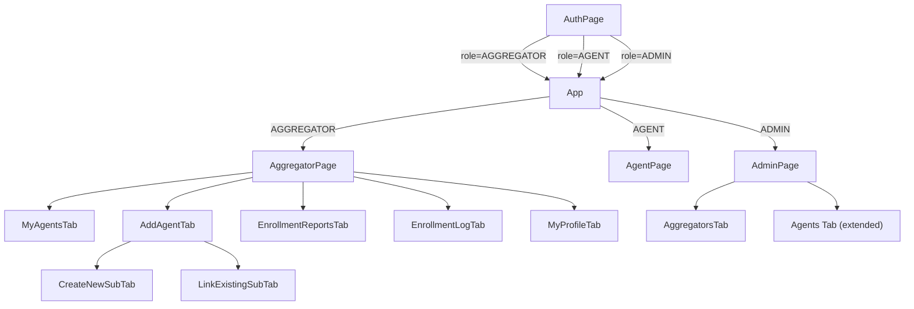

# Design Document — Aggregator Portal

## Overview

The Aggregator Portal introduces a new `AGGREGATOR` role that sits between Admins and Agents in the NIMC Ward Enrollment system. Aggregators supervise a subset of Agents and view enrollment data scoped exclusively to those agents. They cannot modify enrollment records or agent data.

The feature touches five areas of the existing codebase:

1. **AuthPage.tsx** — Sign Up section gains two sub-tabs (Agent Sign Up / Aggregator Sign Up).
2. **App.tsx** — Role-based routing extended to handle `'AGGREGATOR'`.
3. **AggregatorPage.tsx** — New page with five tabs: My Agents, Add Agent, Enrollment Reports, Enrollment Log, My Profile.
4. **AdminPage.tsx** — Add Aggregator role to the Add User form, add an Aggregators list tab, add assign-to-aggregator control on agent records, add State/LGA fields for AGENT creation.
5. **firestore.rules** — New rules for aggregator-scoped reads and the agent-link write.

A new Firestore document `counters/aggregatorId` tracks the sequential Aggregator ID counter.

---

## Architecture



### Key Design Decisions

**Secondary Firebase App pattern**: Creating a new Firebase Auth user from within an authenticated session (Aggregator creating an agent, Admin creating any user) uses `initializeApp(config, 'secondary-' + Date.now())` to spin up a temporary app instance. This is the same pattern already used in `AdminPage.tsx`. The secondary auth instance is signed out immediately after the new user is created.

**Scoped enrollment queries**: Firestore does not support JOINs. To fetch enrollments for an aggregator's agents, the app first fetches the list of linked agent UIDs, then uses a Firestore `in` query on `agentId`. Firestore limits `in` queries to 30 values per query; if an aggregator has more than 30 agents, the app batches the UIDs into chunks of 30 and runs parallel queries, then merges results client-side.

**Aggregator ID generation**: A Firestore transaction on `counters/aggregatorId` atomically reads the current sequence number, increments it, writes it back, and returns the new value. The ID is formatted as `2PLUS/AGG/ENR/` + `String(n).padStart(3, '0')`. If the counter document does not exist, the transaction initialises it to `1`.

**GeoData loading**: All forms that need State/LGA dropdowns call the existing `loadGeoData()` from `geoData.ts`. Each page/component that needs it loads it once on mount via `useEffect`.

---

## Components and Interfaces

### New Files

| File | Purpose |
|------|---------|
| `frontend/src/pages/AggregatorPage.tsx` | Main dashboard for AGGREGATOR role |
| `frontend/src/aggregatorUtils.ts` | Pure utility functions: ID formatting, enrollment scoping, search filtering, form validation |

### Modified Files

| File | Changes |
|------|---------|
| `frontend/src/App.tsx` | Add `'AGGREGATOR'` to role type; render `AggregatorPage` for that role |
| `frontend/src/pages/AuthPage.tsx` | Add Sign Up sub-tabs; add Aggregator Sign Up form with State/LGA; add State/LGA to Agent Sign Up form |
| `frontend/src/pages/AdminPage.tsx` | Add Aggregators tab; add AGGREGATOR to role dropdown; add State/LGA fields for AGENT role; add assign-aggregator control on agent records |
| `frontend/firestore.rules` | Add aggregator-scoped rules |

### AggregatorPage Tab Structure

```
AggregatorPage
├── My Agents          — list of linked agents (read-only)
├── Add Agent
│   ├── Create New     — create Firebase Auth user + Firestore doc via secondary app
│   └── Link Existing  — search unlinked agents, write aggregatorId
├── Enrollment Reports — scoped daily enrollment records with filters
├── Enrollment Log     — scoped monthly enrollment log entries
└── My Profile         — read-only aggregatorId, editable phone
```

### TypeScript Interfaces

```typescript
// Aggregator user document shape
interface AggregatorUser {
  id: string;           // Firebase UID
  name: string;
  email: string;
  role: 'AGGREGATOR';
  aggregatorId: string; // e.g. "2PLUS/AGG/ENR/001"
  phone: string;
  profileStateId: string;
  profileStateName: string;
  profileLgaId: string;
  profileLgaName: string;
  createdAt: string;    // ISO 8601
}

// Agent user document shape (extended)
interface AgentUser {
  id: string;
  name: string;
  email: string;
  role: 'AGENT';
  deviceId: string;
  phone: string;
  profileStateId: string;
  profileStateName: string;
  profileLgaId: string;
  profileLgaName: string;
  createdAt: string;
  aggregatorId?: string | null; // Firebase UID of supervising aggregator, or absent/null
  // existing account fields omitted for brevity
}

// Counter document
interface AggregatorIdCounter {
  lastSequence: number; // last issued sequence number
}
```

---

## Data Models

### Firestore Collections

#### `users` collection — extended fields

| Field | Type | Roles | Description |
|-------|------|-------|-------------|
| `role` | `'AGENT' \| 'ADMIN' \| 'AGGREGATOR'` | all | Extended to include AGGREGATOR |
| `aggregatorId` | `string` | AGGREGATOR | Formatted ID string e.g. `2PLUS/AGG/ENR/001` |
| `aggregatorId` | `string \| null` | AGENT | Firebase UID of supervising aggregator; absent or null if unlinked |
| `profileStateId` | `string` | AGENT, AGGREGATOR | State ID from GeoData |
| `profileStateName` | `string` | AGENT, AGGREGATOR | State name |
| `profileLgaId` | `string` | AGENT, AGGREGATOR | LGA ID from GeoData |
| `profileLgaName` | `string` | AGENT, AGGREGATOR | LGA name |

> Note: The `aggregatorId` field has different semantics depending on the document's `role`. On AGGREGATOR documents it holds the formatted `2PLUS/AGG/ENR/NNN` string. On AGENT documents it holds the Firebase UID of the supervising aggregator.

#### `counters/aggregatorId` document

```
counters/
  aggregatorId/
    lastSequence: number   // starts at 0, incremented to 1 on first aggregator creation
```

### Aggregator ID Generation Algorithm

```typescript
// aggregatorUtils.ts — pure formatting function
export function formatAggregatorId(sequence: number): string {
  return `2PLUS/AGG/ENR/${String(sequence).padStart(3, '0')}`;
}

// Firestore transaction (called from AggregatorPage and AdminPage)
async function generateAggregatorId(db: Firestore): Promise<string> {
  const counterRef = doc(db, 'counters', 'aggregatorId');
  return runTransaction(db, async (tx) => {
    const snap = await tx.get(counterRef);
    const next = snap.exists() ? (snap.data().lastSequence as number) + 1 : 1;
    tx.set(counterRef, { lastSequence: next });
    return formatAggregatorId(next);
  });
}
```

The transaction guarantees that even if two aggregator accounts are created simultaneously, each receives a unique sequence number.

---

## Firestore Query Patterns

### Fetching Linked Agents

```typescript
// Query agents whose aggregatorId equals the current aggregator's UID
const q = query(
  collection(db, 'users'),
  where('aggregatorId', '==', aggregatorUid),
  where('role', '==', 'AGENT')
);
```

### Scoped Enrollment Reports (batched `in` query)

```typescript
// aggregatorUtils.ts — pure batching function
export function chunkArray<T>(arr: T[], size: number): T[][] {
  const chunks: T[][] = [];
  for (let i = 0; i < arr.length; i += size) {
    chunks.push(arr.slice(i, i + size));
  }
  return chunks;
}

// In AggregatorPage — fetch enrollments for all linked agents
async function loadScopedEnrollments(agentUids: string[]): Promise<Enrollment[]> {
  if (agentUids.length === 0) return [];
  const batches = chunkArray(agentUids, 30);
  const results = await Promise.all(
    batches.map(batch =>
      getDocs(query(
        collection(db, 'enrollments'),
        where('agentId', 'in', batch)
      ))
    )
  );
  return results.flatMap(snap => snap.docs.map(d => ({ id: d.id, ...d.data() } as Enrollment)));
}
```

The same batching pattern applies to `enrollmentLogs`.

### Searching Unlinked Agents (Link Existing flow)

The search is performed client-side after fetching a candidate set from Firestore. The Firestore query fetches agents with `role == 'AGENT'` and no `aggregatorId` field set. Because Firestore cannot query for absent fields directly, the query fetches agents where `aggregatorId == null` (agents explicitly set to null) combined with a separate fetch for agents where the field is absent — or alternatively, the app fetches all AGENT documents and filters client-side. Given the expected scale (hundreds of agents, not millions), client-side filtering is acceptable.

```typescript
// aggregatorUtils.ts — pure search filter
export function filterUnlinkedAgents(
  agents: AgentUser[],
  searchTerm: string,
): AgentUser[] {
  const unlinked = agents.filter(a => !a.aggregatorId);
  if (!searchTerm.trim()) return unlinked;
  const lower = searchTerm.toLowerCase();
  return unlinked.filter(a =>
    a.name.toLowerCase().includes(lower) ||
    a.email.toLowerCase().includes(lower) ||
    (a.deviceId ?? '').toLowerCase().includes(lower)
  );
}
```

---

## AuthPage UI Changes

### Sign Up Sub-Tabs

When the outer tab is `'register'`, a second row of sub-tabs appears:

```
[ Login ] [ Sign Up ]          ← outer tabs (existing)
          [ Agent Sign Up ] [ Aggregator Sign Up ]   ← sub-tabs (new)
```

State variable: `signUpSubTab: 'agent' | 'aggregator'` (default `'agent'`).

### Agent Sign Up Form (extended)

Adds State and LGA dropdowns after the Phone field. GeoData is loaded once on mount. The LGA dropdown is disabled until a state is selected. On submit, `profileStateId`, `profileStateName`, `profileLgaId`, `profileLgaName` are written to Firestore alongside existing fields.

### Aggregator Sign Up Form (new)

Fields: Full Name, Email, Password, Confirm Password, Phone, State (dropdown), LGA (dropdown). No Device ID field. On submit:

1. Validate all fields non-empty; passwords match; state and LGA selected.
2. `createUserWithEmailAndPassword` on the primary auth instance (the user is registering themselves, so signing in is the desired outcome).
3. `runTransaction` to generate the next Aggregator ID.
4. `setDoc` to write the user document with `role: 'AGGREGATOR'`, `aggregatorId`, `profileStateId`, `profileStateName`, `profileLgaId`, `profileLgaName`, `phone`, `createdAt`.
5. Firebase Auth state change triggers `onAuthStateChanged` in `App.tsx`, which reads the role and routes to `AggregatorPage`.

---

## AggregatorPage Component Structure

```typescript
// Tabs
type AggregatorTab = 'agents' | 'addAgent' | 'reports' | 'enrollmentLog' | 'profile';
type AddAgentSubTab = 'create' | 'link';

// Props
interface Props { user: User; }
```

### My Agents Tab

- On mount (and when tab is selected), queries `users` where `aggregatorId == user.uid` and `role == 'AGENT'`.
- Displays a table: Name, Email, Device ID, Phone.
- No edit/delete controls.
- Shows aggregator's own `aggregatorId` in a prominent badge at the top of the page (visible across all tabs).
- Empty state: "No agents linked yet."

### Add Agent Tab — Create New Sub-Tab

- Form fields: Name, Email, Password, Device ID, Phone, State (dropdown), LGA (dropdown).
- All fields required; validated before submit.
- On submit: secondary Firebase App → `createUserWithEmailAndPassword` → `setDoc` with `aggregatorId: user.uid`.
- On success: append new agent to local `myAgents` state; switch to My Agents tab.
- Error handling: "Email already registered." for `auth/email-already-in-use`; descriptive message for Firestore write failure.

### Add Agent Tab — Link Existing Sub-Tab

- Search input (name, email, or Device ID).
- On search: fetch all AGENT users, filter client-side via `filterUnlinkedAgents`.
- Display results with a "Link" button per row.
- On link confirm: use a Firestore transaction to atomically re-read the agent document and verify `aggregatorId` is still unset before writing. This guards against the race condition where two Aggregators simultaneously attempt to link the same Agent — the Firestore security rule (`!('aggregatorId' in resource.data) || resource.data.aggregatorId == null`) provides the server-side enforcement, and the transaction ensures the client detects the conflict cleanly:

```typescript
// Use a transaction to atomically check-and-set the aggregatorId
await runTransaction(db, async (tx) => {
  const agentRef = doc(db, 'users', agentId);
  const agentSnap = await tx.get(agentRef);
  if (!agentSnap.exists()) throw new Error('Agent not found.');
  const data = agentSnap.data();
  if (data.aggregatorId) throw new Error('This agent is already linked to another aggregator.');
  tx.update(agentRef, { aggregatorId: aggregatorUid });
});
```

- On success: append agent to local `myAgents` state; clear search results.
- If the transaction throws `'This agent is already linked to another aggregator.'`, display that message and do not update the local agent list.

### Enrollment Reports Tab

- On tab select: if `myAgents` is empty, show empty state without querying Firestore.
- Otherwise: call `loadScopedEnrollments(agentUids)`.
- Filter controls: date-from, date-to, agent name search (client-side).
- Summary total: sum of `dailyFigures` across filtered records.
- Table columns: Date, Agent Name, State, LGA, Ward, Device ID, Daily Figures, Issues/Complaints.
- No edit/delete controls.

### Enrollment Log Tab

- Same scoping pattern as Enrollment Reports but queries `enrollmentLogs`.
- Table columns: Agent Name, Month, Year, Total Enrollment.
- Uses existing `formatMonthName` and `sortEnrollmentLogs` from `enrollmentLogUtils.ts`.

### My Profile Tab

- Displays: Name (read-only), Email (read-only), Aggregator ID (read-only, styled as a badge), Phone (editable).
- Save button calls `updateDoc` on the user's Firestore document with the new phone value.

---

## AdminPage Additions

### Role Dropdown Extension

The `newRole` state type changes from `'AGENT' | 'ADMIN'` to `'AGENT' | 'ADMIN' | 'AGGREGATOR'`. The select element gains an `AGGREGATOR` option.

### State/LGA Fields for AGENT Role

When `newRole === 'AGENT'`, the Add User form shows State and LGA dropdowns (same pattern as AuthPage). On submit, `profileStateId`, `profileStateName`, `profileLgaId`, `profileLgaName` are written to the new agent's document.

### Aggregator Creation Flow

When `newRole === 'AGGREGATOR'`:
- No Device ID field shown.
- On submit: secondary Firebase App creates the Auth user; `generateAggregatorId` transaction runs; `setDoc` writes the document with `role: 'AGGREGATOR'` and the generated `aggregatorId`.
- Success message shows the generated Aggregator ID: `"${name}" created as AGGREGATOR. ID: 2PLUS/AGG/ENR/001`.

### Aggregators Tab

New tab alongside existing tabs. Queries `users` where `role == 'AGGREGATOR'`. Displays: Name, Email, Aggregator ID, Phone. No edit controls in the initial implementation (phone reset can be added later).

### Assign-to-Aggregator Control on Agent Records

In the Agents tab, each agent row gains an "Assign Aggregator" dropdown/button. The dropdown lists all aggregators (fetched once when the Agents tab loads). Selecting an aggregator and confirming writes the aggregator's Firebase UID to the agent's `aggregatorId` field. If the agent already has an `aggregatorId`, a confirmation prompt is shown before overwriting.

---

## App.tsx Routing Changes

```typescript
// Before
const [role, setRole] = useState<'AGENT' | 'ADMIN' | null>(null);

// After
const [role, setRole] = useState<'AGENT' | 'ADMIN' | 'AGGREGATOR' | null>(null);

// Routing
if (role === 'ADMIN') return <AdminPage user={user} />;
if (role === 'AGGREGATOR') return <AggregatorPage user={user} />;
return <AgentPage user={user} />;
```

---

## Security Rules Design

```javascript
rules_version = '2';
service cloud.firestore {
  match /databases/{database}/documents {

    function isAdmin() {
      return request.auth != null &&
        get(/databases/$(database)/documents/users/$(request.auth.uid)).data.role == 'ADMIN';
    }

    function isAggregator() {
      return request.auth != null &&
        get(/databases/$(database)/documents/users/$(request.auth.uid)).data.role == 'AGGREGATOR';
    }

    function callerAggregatorUid() {
      return request.auth.uid;
    }

    match /users/{userId} {
      // Users can read/write their own profile
      allow read, write: if request.auth != null && request.auth.uid == userId;
      // Admins can read and write any user document
      allow read, write: if isAdmin();
      // Aggregators can read agent documents linked to them
      allow read: if isAggregator() &&
        resource.data.role == 'AGENT' &&
        resource.data.aggregatorId == callerAggregatorUid();
      // Aggregators can link an unlinked agent to themselves
      // Server-side enforcement of the exclusive ownership constraint (Requirement 12):
      // the condition `!('aggregatorId' in resource.data) || resource.data.aggregatorId == null`
      // ensures that once an agent is owned by any aggregator, no other aggregator can
      // overwrite that field via a direct write. The transaction-based link operation in the
      // client provides the check-and-set pattern; this rule is the authoritative backstop.
      allow update: if isAggregator() &&
        resource.data.role == 'AGENT' &&
        (!('aggregatorId' in resource.data) || resource.data.aggregatorId == null) &&
        request.resource.data.aggregatorId == callerAggregatorUid() &&
        request.resource.data.diff(resource.data).affectedKeys().hasOnly(['aggregatorId']);
      // Aggregators can create new agent documents with their UID as aggregatorId
      allow create: if isAggregator() &&
        request.resource.data.role == 'AGENT' &&
        request.resource.data.aggregatorId == callerAggregatorUid();
    }

    match /enrollments/{docId} {
      allow create: if request.auth != null &&
        request.resource.data.agentId == request.auth.uid;
      allow read, list: if request.auth != null;
      allow delete: if isAdmin();
      allow update: if isAdmin();
    }

    match /enrollmentLogs/{docId} {
      allow create, update: if isAdmin();
      allow read, list: if request.auth != null && (
        isAdmin() ||
        resource.data.agentId == request.auth.uid ||
        (isAggregator() &&
          get(/databases/$(database)/documents/users/$(resource.data.agentId)).data.aggregatorId == callerAggregatorUid())
      );
      allow delete: if isAdmin();
    }

    match /counters/{docId} {
      // Only authenticated users can read/write counters (for ID generation)
      allow read, write: if request.auth != null;
    }
  }
}
```

**Design rationale for enrollment reads**: The `enrollments` collection currently allows any authenticated user to read all records (client-side filtering is used). This is preserved for now. The aggregator's scoping is enforced at the application layer. A future hardening pass could add server-side enforcement using the same `get()` lookup pattern shown in `enrollmentLogs`.

**Limitation**: Firestore security rules cannot enforce the `in` query pattern server-side without `get()` calls per document, which are expensive. The current design trusts the application layer for enrollment scoping and uses rules to prevent direct writes.

---

## Error Handling

| Scenario | Handling |
|----------|---------|
| `auth/email-already-in-use` on any registration | Display "Email already registered." |
| `auth/weak-password` | Display "Password must be at least 6 characters." |
| Passwords don't match | Client-side validation before submit; display "Passwords do not match." |
| Empty state or LGA on submit | Client-side validation; display "State and LGA are required." |
| Firestore write fails after Auth user created | Display "Account partially created. Contact support." Do not update local state. |
| Firestore write fails on agent link | Display descriptive error; do not update local agent list. |
| Agent already linked when link is attempted (race condition) | Display "This agent is already linked to another aggregator." Do not update local agent list. |
| Aggregator ID counter transaction fails | Display "Failed to generate Aggregator ID. Please try again." Roll back — no user created. |
| Phone update fails | Display "Failed to update profile: [error message]." |
| Empty agent set before enrollment query | Skip Firestore query; display empty state message. |

---

## Testing Strategy

### Unit Tests

Unit tests cover specific examples, edge cases, and pure utility functions in `aggregatorUtils.ts`:

- `formatAggregatorId` with specific inputs (1 → `2PLUS/AGG/ENR/001`, 99 → `2PLUS/AGG/ENR/099`, 100 → `2PLUS/AGG/ENR/100`, 999 → `2PLUS/AGG/ENR/999`)
- `filterUnlinkedAgents` with empty search term, with a term matching name/email/deviceId, with all agents already linked
- `chunkArray` with arrays smaller than chunk size, exactly chunk size, and larger
- `scopeEnrollmentsByAgentUids` with empty UID set, with records belonging to mixed agents
- Form validation: all-empty inputs, one empty field, all valid

### Property-Based Tests

Property tests use **fast-check** (the standard PBT library for TypeScript/JavaScript). Each test runs a minimum of 100 iterations.

The testing strategy combines:
- **Unit tests** for specific examples and edge cases
- **Property tests** for universal correctness guarantees on pure functions

Property tests are tagged with: `Feature: aggregator-portal, Property N: <property text>`


---

## Correctness Properties

*A property is a characteristic or behavior that should hold true across all valid executions of a system — essentially, a formal statement about what the system should do. Properties serve as the bridge between human-readable specifications and machine-verifiable correctness guarantees.*

### Property 1: Aggregator ID format is always correct

*For any* positive integer sequence number `n`, `formatAggregatorId(n)` shall return a string that starts with `'2PLUS/AGG/ENR/'` and ends with `n` zero-padded to at least three digits.

**Validates: Requirements 1.2**

### Property 2: Aggregator ID sequence numbers are unique

*For any* two distinct positive integers `a` and `b`, `formatAggregatorId(a)` shall not equal `formatAggregatorId(b)`.

**Validates: Requirements 1.2, 1.3**

### Property 3: Enrollment scoping excludes non-linked agents

*For any* list of enrollment records and any set of aggregator-linked agent UIDs, `scopeEnrollmentsByAgentUids(records, linkedUids)` shall return exactly those records whose `agentId` is contained in `linkedUids` — no more, no fewer.

**Validates: Requirements 7.1, 7.7**

### Property 4: Enrollment summary total equals sum of daily figures

*For any* list of enrollment records, the computed summary total shall equal the arithmetic sum of each record's `dailyFigures` value.

**Validates: Requirements 7.6**

### Property 5: Unlinked agent search returns only unlinked agents matching the term

*For any* list of agent user documents and any non-empty search term, `filterUnlinkedAgents(agents, term)` shall return only agents that (a) have no `aggregatorId` set and (b) have the search term as a case-insensitive substring of their name, email, or Device ID.

**Validates: Requirements 5.2**

### Property 6: Array chunking covers all elements without duplication

*For any* array and any positive chunk size, `chunkArray(arr, size)` shall produce chunks whose concatenation equals the original array (same elements, same order), and every chunk except possibly the last shall have exactly `size` elements.

**Validates: Requirements 7.1, 7.2** (correctness of the batched `in` query approach)

### Property 7: Form validation rejects submissions with any empty required field

*For any* agent creation form input where at least one required field (name, email, password, deviceId, phone, stateId, lgaId) is an empty string or whitespace-only string, the validation function shall return an error and shall not return a valid submission object.

**Validates: Requirements 5b.7, 10.8**

### Property 8: LGA dropdown resets when state changes

*For any* state selection change, the resulting LGA list shall equal exactly the LGAs belonging to the newly selected state, and the previously selected LGA ID shall be cleared (set to empty string).

**Validates: Requirements 2.7, 5b.8, 10.2, 11.7**

### Property 9: Agent exclusive ownership is preserved under concurrent link attempts

*For any* agent document and any two concurrent Aggregator link operations targeting that agent, at most one operation shall succeed in writing its `aggregatorId` to the agent document. The transaction-based link operation shall ensure that if two Aggregators concurrently attempt to link the same Agent, exactly one succeeds and the other receives the error `'This agent is already linked to another aggregator.'` — the `aggregatorId` field shall never hold more than one Aggregator's UID simultaneously.

**Validates: Requirements 5.6, 12.1, 12.2, 12.3**
