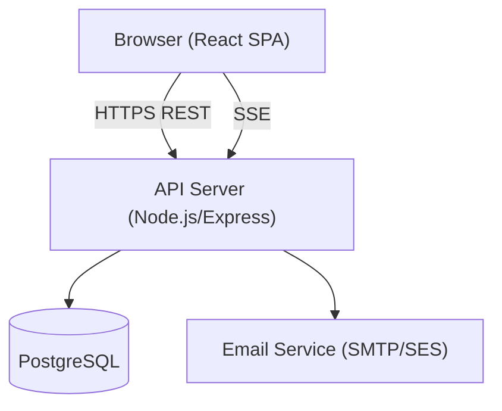

# Design Document: NIMC Ward Enrollment Portal

## Overview

The NIMC Ward Enrollment Portal is a web-based SaaS application that enables field agents to submit daily enrollment data at the ward level and allows NIMC admins to monitor, manage, and export that data. The system supports two roles — Agent and Admin — with strict role-based access control.

The portal is built as a full-stack web application with a React frontend and a Node.js/Express REST API backend, backed by a PostgreSQL relational database. Authentication uses JWT tokens with session expiry enforcement. All communication is over HTTPS.

Key design goals:
- Clear separation between Agent and Admin workflows
- Reliable data integrity for enrollment submissions (male + female = total validation)
- Hierarchical geographic drill-down (State → LGA → Ward)
- Real-time notification delivery via server-sent events or polling
- CSV export for up to 10,000 records within 10 seconds

---

## Architecture

The system follows a three-tier architecture:

```
┌─────────────────────────────────────────────────────────┐
│                     Client (Browser)                    │
│              React SPA (Vite + TypeScript)              │
│   Agent UI  │  Admin Dashboard  │  Shared Components   │
└─────────────────────────┬───────────────────────────────┘
                          │ HTTPS / REST + SSE
┌─────────────────────────▼───────────────────────────────┐
│                  API Server (Node.js/Express)            │
│  Auth Middleware │ RBAC Middleware │ Route Handlers      │
│  Enrollment Service │ Notification Service │ Export Svc  │
└─────────────────────────┬───────────────────────────────┘
                          │
┌─────────────────────────▼───────────────────────────────┐
│                  PostgreSQL Database                     │
│  users │ wards │ lgas │ states │ submissions │           │
│  notifications │ audit_log                               │
└─────────────────────────────────────────────────────────┘
```



### Technology Choices

| Layer | Technology | Rationale |
|---|---|---|
| Frontend | React + TypeScript + Vite | Component model suits role-based UI; TypeScript catches data shape errors early |
| Styling | Tailwind CSS | Rapid UI development; consistent design tokens |
| State management | React Query (TanStack Query) | Server-state caching, background refresh, optimistic updates |
| Backend | Node.js + Express | Lightweight, well-understood REST API layer |
| ORM | Prisma | Type-safe DB access; migration management |
| Database | PostgreSQL | Relational integrity for hierarchical geo data and submissions |
| Auth | JWT (access token) + HTTP-only refresh cookie | Stateless auth with secure session invalidation |
| Notifications | Server-Sent Events (SSE) | Lightweight push for in-portal notifications without WebSocket overhead |
| CSV Export | `csv-stringify` (Node.js streaming) | Streaming generation handles 10k rows within time budget |
| Email | Nodemailer + SMTP/SES | Password-setup emails for new agents |

---

## Components and Interfaces

### Frontend Components

```
src/
  pages/
    LoginPage
    agent/
      DashboardPage          # enrollment form + today's submission
      SubmissionHistoryPage  # past submissions list + detail
      ProfilePage
    admin/
      DashboardPage          # stats overview + drill-down table
      EnrollmentRecordsPage  # filterable records list
      AgentManagementPage    # agent CRUD
      NotificationsPage
  components/
    EnrollmentForm           # controlled form with validation
    DrillDownTable           # State → LGA → Ward navigation
    NotificationBell         # unread count badge + panel
    FilterBar                # State/LGA/Ward/Agent/date range filters
    ExportButton             # triggers CSV download
  hooks/
    useAuth                  # JWT token management, session expiry
    useNotifications         # SSE connection + unread count
  api/
    authApi
    enrollmentApi
    adminApi
    notificationApi
```

### Backend Modules

```
src/
  routes/
    auth.ts          # POST /auth/login, POST /auth/logout, POST /auth/refresh
    enrollment.ts    # GET/POST/PUT /enrollment/submissions
    admin/
      dashboard.ts   # GET /admin/dashboard/stats, /admin/dashboard/states/:id/lgas, etc.
      records.ts     # GET /admin/records (filtered), PUT /admin/records/:id/flag
      agents.ts      # GET/POST/PUT/DELETE /admin/agents
      export.ts      # GET /admin/export/csv
    notifications.ts # GET /notifications, PUT /notifications/:id/read, GET /notifications/stream
  middleware/
    authenticate.ts  # JWT verification, session expiry check
    authorize.ts     # RBAC role check
  services/
    enrollmentService.ts
    notificationService.ts
    exportService.ts
    emailService.ts
  prisma/
    schema.prisma
```

### Key API Endpoints

| Method | Path | Role | Description |
|---|---|---|---|
| POST | /auth/login | Public | Authenticate user, return JWT |
| POST | /auth/logout | Any | Invalidate session |
| GET | /enrollment/submissions | Agent | List own submissions |
| POST | /enrollment/submissions | Agent | Create daily submission |
| PUT | /enrollment/submissions/:id | Agent | Edit today's submission |
| GET | /admin/dashboard/stats | Admin | Aggregate stats for today |
| GET | /admin/dashboard/states | Admin | State-level summary table |
| GET | /admin/dashboard/states/:id/lgas | Admin | LGA drill-down |
| GET | /admin/dashboard/lgas/:id/wards | Admin | Ward drill-down |
| GET | /admin/records | Admin | Filtered enrollment records |
| PUT | /admin/records/:id/flag | Admin | Flag submission as Under Review |
| GET | /admin/export/csv | Admin | Stream CSV export |
| GET | /admin/agents | Admin | List agents |
| POST | /admin/agents | Admin | Create agent |
| PUT | /admin/agents/:id | Admin | Update/deactivate/reassign agent |
| GET | /notifications | Any | List notifications for user |
| PUT | /notifications/:id/read | Any | Mark notification as read |
| GET | /notifications/stream | Any | SSE stream for live notifications |

---

## Data Models

### Prisma Schema

```prisma
model State {
  id    String @id @default(cuid())
  name  String @unique
  lgas  Lga[]
}

model Lga {
  id      String @id @default(cuid())
  name    String
  stateId String
  state   State  @relation(fields: [stateId], references: [id])
  wards   Ward[]

  @@unique([name, stateId])
}

model Ward {
  id      String @id @default(cuid())
  name    String
  lgaId   String
  lga     Lga    @relation(fields: [lgaId], references: [id])
  agents  User[]
  submissions DailySubmission[]

  @@unique([name, lgaId])
}

model User {
  id            String    @id @default(cuid())
  email         String    @unique
  passwordHash  String
  name          String
  role          Role      @default(AGENT)
  status        UserStatus @default(ACTIVE)
  wardId        String?   // null for Admin
  ward          Ward?     @relation(fields: [wardId], references: [id])
  submissions   DailySubmission[]
  notifications Notification[]
  lastActiveAt  DateTime?
  createdAt     DateTime  @default(now())
  updatedAt     DateTime  @updatedAt
}

enum Role {
  AGENT
  ADMIN
}

enum UserStatus {
  ACTIVE
  INACTIVE
}

model DailySubmission {
  id              String           @id @default(cuid())
  enrollmentDate  DateTime         @db.Date
  totalEnrollees  Int
  maleCount       Int
  femaleCount     Int
  remarks         String?
  status          SubmissionStatus @default(SUBMITTED)
  flagReason      String?
  agentId         String
  agent           User             @relation(fields: [agentId], references: [id])
  wardId          String
  ward            Ward             @relation(fields: [wardId], references: [id])
  submittedAt     DateTime         @default(now())
  updatedAt       DateTime         @updatedAt

  @@unique([agentId, enrollmentDate])
}

enum SubmissionStatus {
  SUBMITTED
  UNDER_REVIEW
}

model Notification {
  id        String           @id @default(cuid())
  userId    String
  user      User             @relation(fields: [userId], references: [id])
  type      NotificationType
  message   String
  isRead    Boolean          @default(false)
  createdAt DateTime         @default(now())
}

enum NotificationType {
  SUBMISSION_FLAGGED
  AGENT_CREATED
}
```

### Key Data Constraints

- `DailySubmission`: unique constraint on `(agentId, enrollmentDate)` — one submission per agent per day
- `DailySubmission`: application-level invariant: `maleCount + femaleCount = totalEnrollees`
- `User` with role `AGENT` must have a non-null `wardId`
- `User` with role `ADMIN` has null `wardId`
- Ward reassignment preserves historical submissions (wardId on submission is snapshotted at submission time)
- Session expiry: JWT `exp` claim set to 30 minutes; refresh token in HTTP-only cookie

### Session Management

JWT access tokens carry `userId`, `role`, and `exp` (30-minute expiry). The server validates `exp` on every protected request. When an admin deactivates an agent, a `revokedAt` timestamp is written to the user record; the auth middleware rejects tokens issued before `revokedAt`.

```
User.revokedAt: DateTime?   // set on deactivation; tokens issued before this are invalid
```


---

## Correctness Properties

*A property is a characteristic or behavior that should hold true across all valid executions of a system — essentially, a formal statement about what the system should do. Properties serve as the bridge between human-readable specifications and machine-verifiable correctness guarantees.*

### Property 1: Valid credentials produce a session

*For any* user with a valid email and password in the system, submitting those credentials to the login endpoint should return a JWT access token and the user's role.

**Validates: Requirements 1.2**

---

### Property 2: Invalid credentials produce no session

*For any* credential pair where the email does not exist or the password does not match, the login endpoint should return an error response and must not return a JWT token.

**Validates: Requirements 1.3**

---

### Property 3: Expired tokens are rejected on all protected routes

*For any* protected API endpoint and any JWT whose `exp` claim is in the past (or whose user has a `revokedAt` timestamp after the token's `iat`), the server should return a 401 Unauthorized response.

**Validates: Requirements 1.4, 1.6**

---

### Property 4: Role checks enforced on every protected endpoint

*For any* protected API endpoint that requires the Admin role, a request authenticated with an Agent token should receive a 403 Forbidden response and must not return the protected resource.

**Validates: Requirements 2.2, 2.4**

---

### Property 5: Every user has exactly one valid role

*For any* user record in the database, the `role` field must be exactly one of `AGENT` or `ADMIN` — never null, never both.

**Validates: Requirements 2.1**

---

### Property 6: Agent accounts always have a complete geographic assignment

*For any* user with role `AGENT`, their `wardId` must be non-null, and the referenced ward must have a valid `lgaId`, which in turn must have a valid `stateId`.

**Validates: Requirements 3.1, 3.3, 3.4**

---

### Property 7: Agent creation without ward assignment is rejected

*For any* agent creation request that omits the wardId (or stateId/lgaId), the API should return a validation error and must not persist the user record.

**Validates: Requirements 3.3, 3.4**

---

### Property 8: Enrollment form is pre-populated with agent's geographic data

*For any* authenticated agent, the enrollment submission page response should include the agent's assigned ward name, LGA name, state name, and today's date as default values.

**Validates: Requirements 4.1**

---

### Property 9: Valid enrollment submission is persisted and retrievable

*For any* valid enrollment submission (all required fields present, maleCount + femaleCount = totalEnrollees), submitting it should result in the record being stored and subsequently retrievable via the agent's submission history.

**Validates: Requirements 4.2, 4.3**

---

### Property 10: Invalid enrollment submissions are rejected without persistence

*For any* enrollment submission where a required field is missing or where maleCount + femaleCount ≠ totalEnrollees, the API should return a validation error and must not create or modify any submission record.

**Validates: Requirements 4.4, 4.5**

---

### Property 11: Same-day submission is editable; edit form shows last-saved values

*For any* agent who has already submitted for today, submitting again for the same date should update the existing record (not create a duplicate), and the edit form should be pre-populated with the last-saved field values.

**Validates: Requirements 4.6, 4.7**

---

### Property 12: Agent submission history is complete, ordered, and contains required fields

*For any* agent with N submissions, the submission history endpoint should return exactly N records, each containing enrollmentDate, totalEnrollees, maleCount, femaleCount, and submittedAt, sorted in descending order by enrollmentDate.

**Validates: Requirements 5.1, 5.2, 5.3, 5.4**

---

### Property 13: Dashboard stats correctly aggregate today's data

*For any* state of the database, the admin dashboard stats endpoint should return totalEnrollees equal to the sum of all `totalEnrollees` from DailySubmissions with today's enrollmentDate, totalSubmissions equal to the count of such records, and activeAgents equal to the count of distinct agentIds in those records.

**Validates: Requirements 6.1**

---

### Property 14: Drill-down aggregations are consistent with flat totals

*For any* set of submissions, the sum of totalEnrollees across all state-level rows in the summary table should equal the overall totalEnrollees from the dashboard stats. The same consistency must hold when drilling down from state → LGA → ward.

**Validates: Requirements 6.2, 6.3, 6.4**

---

### Property 15: Admin records endpoint returns all submissions matching applied filters

*For any* combination of filter parameters (State, LGA, Ward, Agent, date range), the admin records endpoint should return exactly the set of DailySubmissions that satisfy all filter conditions, each including the submitting agent's name and ward assignment.

**Validates: Requirements 7.1, 7.2, 7.4**

---

### Property 16: Flagging a submission updates its status and notifies the agent

*For any* DailySubmission, when an admin flags it as "Under Review" with a non-empty reason, the submission's status should be updated to `UNDER_REVIEW` and a notification of type `SUBMISSION_FLAGGED` should be created for the submitting agent.

**Validates: Requirements 7.5, 7.6, 9.4**

---

### Property 17: CSV export contains exactly the filtered records with all required columns

*For any* filter combination (including date range), the CSV export should contain exactly the same records as the filtered admin records endpoint, and every row must include: enrollmentDate, agentName, ward, LGA, state, totalEnrollees, maleCount, femaleCount, submissionStatus.

**Validates: Requirements 7.7, 10.1, 10.3**

---

### Property 18: Empty export is rejected with an informational message

*For any* date range that yields zero matching records, the export endpoint should return an error response with an informational message and must not produce a CSV file.

**Validates: Requirements 10.4**

---

### Property 19: Agent list is complete and contains required fields

*For any* set of agent users in the database, the admin agent management endpoint should return all of them, each with name, email, assigned ward, and account status.

**Validates: Requirements 8.1**

---

### Property 20: Agent creation triggers a password-setup email

*For any* successful agent account creation, the email service should be called exactly once with the new agent's registered email address.

**Validates: Requirements 8.2**

---

### Property 21: Deactivated agent tokens are rejected

*For any* agent whose account status is `INACTIVE` (or whose `revokedAt` is set), any JWT issued before deactivation should be rejected on all protected endpoints.

**Validates: Requirements 8.3**

---

### Property 22: Duplicate email is rejected on agent creation

*For any* email address already present in the users table, an agent creation request using that email should return a duplicate email error and must not insert a new user record.

**Validates: Requirements 8.4**

---

### Property 23: Ward reassignment preserves historical submissions

*For any* agent with existing DailySubmissions, reassigning the agent to a new ward should update the agent's `wardId` but must not change the `wardId` on any of their existing DailySubmission records.

**Validates: Requirements 8.5, 8.6**

---

### Property 24: Unread notification count is accurate

*For any* user with N unread notifications, the notification indicator value should equal N. After marking any subset of M notifications as read, the indicator should equal N - M.

**Validates: Requirements 9.1, 9.3**

---

### Property 25: Notifications are returned in reverse chronological order

*For any* user, the notifications endpoint should return all their notifications sorted descending by `createdAt`, each with a correct `isRead` status.

**Validates: Requirements 9.2**

---

### Property 26: Admin notification on agent creation

*For any* successful agent account creation, a notification of type `AGENT_CREATED` should be created for every user with role `ADMIN`.

**Validates: Requirements 9.5**

---

## Error Handling

### Authentication Errors

| Scenario | HTTP Status | Response |
|---|---|---|
| Invalid credentials | 401 | `{ error: "Invalid email or password" }` |
| Missing/malformed JWT | 401 | `{ error: "Authentication required" }` |
| Expired JWT | 401 | `{ error: "Session expired" }` |
| Deactivated account | 401 | `{ error: "Account is inactive" }` |

### Authorization Errors

| Scenario | HTTP Status | Response |
|---|---|---|
| Agent accessing admin route | 403 | `{ error: "Access denied" }` |

### Validation Errors

| Scenario | HTTP Status | Response |
|---|---|---|
| Missing required field | 422 | `{ error: "Validation failed", fields: { fieldName: "message" } }` |
| male + female ≠ total | 422 | `{ error: "Male count and female count must sum to total enrollees" }` |
| Duplicate email on agent creation | 409 | `{ error: "Email address is already registered" }` |
| Missing ward on agent creation | 422 | `{ error: "Ward assignment is required for Agent accounts" }` |
| Export with no records | 404 | `{ error: "No records found for the selected date range" }` |

### General Error Handling

- All unhandled exceptions are caught by a global Express error handler and return `500` with a generic message; the full error is logged server-side.
- Database connection failures return `503 Service Unavailable`.
- Input is validated using `zod` schemas at the route handler level before reaching service logic.

---

## Testing Strategy

### Dual Testing Approach

Both unit tests and property-based tests are required. They are complementary:
- Unit tests cover specific examples, integration points, and edge cases.
- Property-based tests verify universal correctness across randomized inputs.

### Unit Tests

Focus areas:
- Login flow: valid credentials, invalid credentials, deactivated account
- RBAC middleware: agent token on admin route, admin token on agent route
- Enrollment form validation: missing fields, male+female≠total, same-day edit
- CSV export: column headers, row content, empty result rejection
- Notification creation: flag submission → agent notification, create agent → admin notification
- Ward reassignment: agent wardId updated, historical submissions unchanged

### Property-Based Testing

**Library**: [fast-check](https://github.com/dubzzz/fast-check) (TypeScript/Node.js)

**Configuration**: Each property test must run a minimum of **100 iterations**.

**Tag format** for each test:
```
// Feature: nimc-ward-enrollment-portal, Property {N}: {property_text}
```

Each of the 26 correctness properties above must be implemented as a single property-based test using `fast-check` arbitraries to generate random inputs. Examples:

```typescript
// Feature: nimc-ward-enrollment-portal, Property 10: Invalid enrollment submissions are rejected without persistence
fc.assert(
  fc.property(
    fc.record({
      totalEnrollees: fc.integer({ min: 1, max: 1000 }),
      maleCount: fc.integer({ min: 0, max: 1000 }),
      femaleCount: fc.integer({ min: 0, max: 1000 }),
    }).filter(({ totalEnrollees, maleCount, femaleCount }) =>
      maleCount + femaleCount !== totalEnrollees
    ),
    async (invalidSubmission) => {
      const result = await submitEnrollment(invalidSubmission);
      expect(result.status).toBe(422);
      const saved = await getSubmissionByDate(invalidSubmission.enrollmentDate);
      expect(saved).toBeNull();
    }
  ),
  { numRuns: 100 }
);
```

```typescript
// Feature: nimc-ward-enrollment-portal, Property 12: Agent submission history is complete, ordered, and contains required fields
fc.assert(
  fc.property(
    fc.array(submissionArbitrary, { minLength: 1, maxLength: 20 }),
    async (submissions) => {
      const agentId = await createTestAgent();
      await Promise.all(submissions.map(s => createSubmission(agentId, s)));
      const history = await getSubmissionHistory(agentId);
      expect(history).toHaveLength(submissions.length);
      // verify descending order
      for (let i = 1; i < history.length; i++) {
        expect(history[i - 1].enrollmentDate >= history[i].enrollmentDate).toBe(true);
      }
      // verify required fields present
      history.forEach(r => {
        expect(r).toHaveProperty('enrollmentDate');
        expect(r).toHaveProperty('totalEnrollees');
        expect(r).toHaveProperty('maleCount');
        expect(r).toHaveProperty('femaleCount');
        expect(r).toHaveProperty('submittedAt');
      });
    }
  ),
  { numRuns: 100 }
);
```

### Test Infrastructure

- **Test runner**: Vitest
- **Database**: Test database seeded and torn down per test suite using Prisma migrations
- **HTTP layer**: `supertest` for API endpoint testing
- **Email service**: Mocked with `vi.mock` to capture calls without sending real emails
- **SSE notifications**: Tested by asserting notification records in DB rather than live SSE stream
